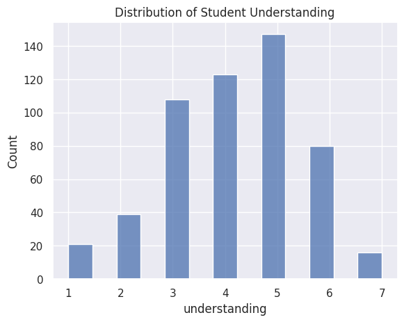

---
# Do not edit the text between these lines!
layout: default
---

# About Me!

I am a Junior from Asheville, North Carolina. I am a Biology B.S. major with minors in Chemistry and Neuroscience. My goal is to attend an Accelerated Nursing program post-grad and hopefully become a CRNA.

<!-- This is a comment. Below, you'll see code for inserting an image. To make this image appear, update <custom-path>. To add an image, save it inside the imgs folder of this repository. -->

## About COMP 110

This exercise involves my analysis from 