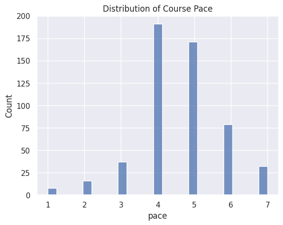
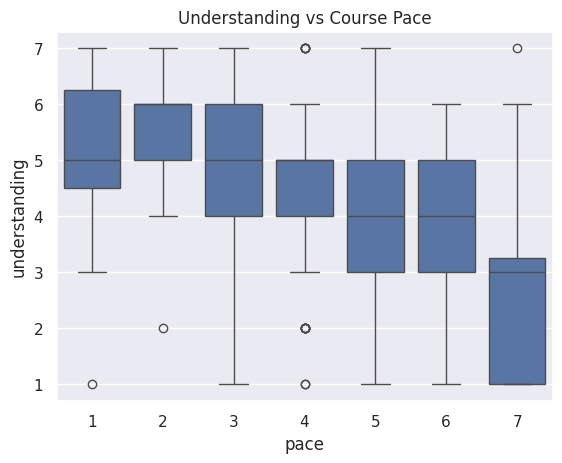

---
# Do not edit the text between these lines!
layout: default
---

# About Me!

Hi, I'm Abby! I am a third year Biology B.S. major, with minors in Chemistry and Neuroscience, from Asheville, North Carolina. My post-grad goals are to attend an Accelerated Bachelor of Science in Nursing program and hopefully become a CRNA later down the line!

## Summary of Analysis in Jupyter Notebook

In my COMP 110 class, we had an assignment involving the analysis of the results from a survey we completed. For my assignment, I chose to compare the variables "pace" and "understanding" so that I could gather data on whether or not students who thought the course's pacing was too fast also felt like they didn't have the best understanding of the material. Below are three graphs I obtained after running various codes:

## Conclusions

In conclusion, there is no significant relationship between perceived course pace and student understanding. These graphs show that students who believe the course is moving at a faster pace do not consistently report lower understanding, although there is some variation across responses. This suggests that course pace alone may not be the primary factor influencing how well students feel they understand the material.

Because the results are somewhat mixed, the data is inconclusive in strongly supporting the idea that adjusting course pace would directly improve student understanding. While some students who perceive a faster pace report lower understanding, this pattern is not consistent enough to draw a definitive conclusion.

To improve confidence in this analysis, future work could include collecting additional data such as exam or assignment performance to compare with perceived understanding. It may also be useful to segment the data by prior programming experience to see if pace affects beginners differently than more experienced students.

Potential trade-offs of adjusting course pace include the possibility that slowing the course down could reduce coverage of important material for more advanced students, while speeding it up could increase stress or confusion for beginners. Therefore, any pacing adjustments would need to carefully balance the needs of different student groups.

Overall, while the idea of adjusting course pace is reasonable, the current data does not provide strong enough evidence to recommend a specific change. Alternative ideas worth exploring could include providing more targeted support resources for students who report lower understanding, rather than changing the overall course pace.